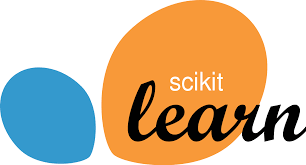

### Hi, I'm Asma 👋

 
 
 

   

Welcome to my GitHub profile! I am passionate about solving real-world problems with data and building robust machine learning models.  
Here, you'll find projects that reflect my skills, interests, and contributions to the data science community.

- 🌱 I’m currently learning **Python | Data Science | Machine Learning | Generative AI | SQL Database**
- ⚡ Fun fact: The first computer "bug" was a real bug! 🪲

## ⚡ Technologies I use

  <table align="center">
    <tr>
        <td align="center" width="140" height="112.43">
            
              Python
        </td>
        <td align="center" width="140" height="112.43">
            
              Jupyter
        </td>
        <td align="center" width="140" height="112.43">
            
              TensorFlow
        </td>
        <td align="center" width="140" height="112.43">
            
              Scikit Learn
        </td>
        <td align="center" width="140" height="112.43">
            
              FastAPI
        </td>
    </tr>
  </table>

> **Technologies Overview**: I primarily work with Python and related frameworks such as **Jupyter**, **TensorFlow**, and **Scikit-learn** for machine learning tasks. I also leverage **FastAPI** for creating robust APIs to deploy models efficiently.

## 📜 Certifications

> **Certifications**: My certifications demonstrate my expertise in data science, machine learning, and AI technologies. They reflect my commitment to continuous learning and upskilling in the rapidly evolving tech field.

- **[Data Science Fundamentals: Essential Tools and Concepts](https://alison.com/shop?course=5729&score=92)** | [Alison](https://alison.com/)
- **[Generative AI](https://www.linkedin.com/learning/certificates/064b2579324a629e754dff2a0849b2417b782f9dbd6a2f1b57ca1ea32dcec82d)** | [NASBA](https://www.linkedin.com/learning/)
- **[Generative AI](https://www.linkedin.com/learning/certificates/30fe65bd16de76c4e3e3337bb6f47de5617b7e7ddf3f54b2a7e439f8504eb97b?trk=share_certificate)** | [LinkedIn Learning](https://www.linkedin.com/learning/)
- **[Integrating Generative AI into Business Strategy](https://www.linkedin.com/learning/certificates/bae9fc50770a4a641f15f7a996792c29d4af0bec4aec8bee22e4a56e4eeb2020?trk=share_certificate)** | [LinkedIn Learning](https://www.linkedin.com/learning/)
- **[Generative AI into Business Strategy](https://www.linkedin.com/learning/certificates/410f9332cf17dee3a6020c934c7f146d9d9178d37c6bfc5ebfac253fd279b349?trk=share_certificate)** | [HRCI](https://www.linkedin.com/learning/)
- **[Introduction to Artificial Intelligence](https://www.linkedin.com/learning/certificates/7fac7b087fc355afe48e33cd52ba6d1de3086d41ce70106c2ead20ec990bf916?trk=share_certificate)** | [BASBA](https://www.linkedin.com/learning/)
- **[Statistics for Data Analysis Using Excel (Accredited)](https://springboard.udemy.com/certificate/UC-5d849150-f7d1-42b2-9230-c7bb41f11916/)** | [Udemy](https://springboard.udemy.com/)
- **[Generative AI into Business Strategy](https://www.linkedin.com/learning/certificates/2dbea2d9f133056281ae8cd66c1fb846dc6f41689b3c5335b1774f8ce431ca7c?trk=share_certificate)** | [CPE](https://www.linkedin.com/learning/)
- **[Generative AI](https://www.pmi.org/certificate-link)** | [Project Management Institute](https://www.pmi.org/)
- **[Introduction to Artificial Intelligence](https://www.linkedin.com/learning/certificates/45f16876797c94986bf1fa3b617f3b2d548b1b01dc005d709b6eff811d99d0d8?trk=share_certificate)** | [LinkedIn Learning](https://www.linkedin.com/learning/)
- **[Accelerating Deep Learning with GPUs](https://courses.cognitiveclass.ai/certificates/83b9ca10dc60435d80c02eeaa5f613e2)** | [CognitiveClass.ai](https://courses.cognitiveclass.ai/)
- **[Python for Beginners](https://moonshot.scaler.com/s/sl/_EbW-c2Hjo)** | [Scaler](https://moonshot.scaler.com/)
- **[SQL for Data Science](https://www.mygreatlearning.com/certificate/BVRKHKZI)** | [Great Learning](https://www.mygreatlearning.com/)

> **Quick Tip**: When viewing my certifications, feel free to click the links to view the full details or explore courses on these platforms for further learning.

## 🎓  Badges

### 🚀 Data Science Tools by Skillsoft
I completed the **Data Science Tools** course on **Skillsoft**, which deepened my understanding of key tools used in data science, such as data visualization and analytics.

- **Platform**: [Skillsoft](https://skillsoft.digitalbadges.skillsoft.com/77d6d6f5-3525-41b9-879a-f473212aff88#acc.861KDOgs)

## 🚀 GitHub Stats & Project

&nbsp;

</picture>

